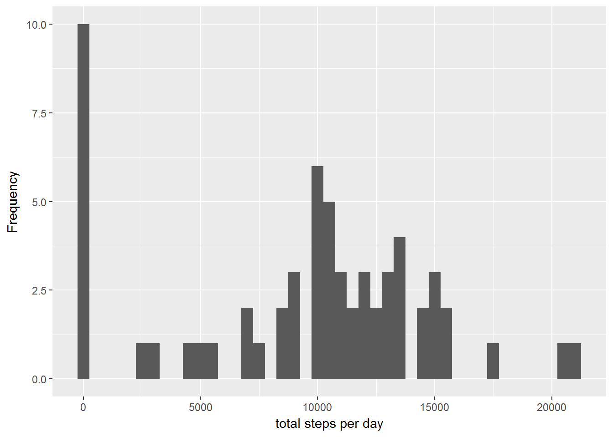

## Loading and preprocessing the data
```{r}
library(ggplot2)
library(plyr)
library(scales)
library(Hmisc)
```


1. Load the data (i.e. read.csv())
```{r}
activitydata <- read.csv('activity.csv')
```


2. Process/transform the data (if necessary) into a format suitable for your analysis
```{r}
activitydata$day <-  ifelse(as.POSIXlt(activitydata$date)$wday %in% c(0,6), 'weekend', 'weekday')
```


## What is mean total number of steps taken per day?
1. Calculate the total number of steps taken per day
```{r}
stepsperday <- tapply(activitydata$steps, activitydata$date, sum, na.rm=TRUE)
```

2. Make a histogram of the total number of steps taken each day
```{r}
qplot(stepsperday, xlab='total steps per day', ylab='Frequency', binwidth=500)
```
 

3. Calculate and report the mean and median total number of steps taken per day
```{r}
Mean_stepsperday <- mean(stepsperday)
Median_stepsperday <- median(stepsperday)
```
* Mean: `r Mean_stepsperday`
* Median:  `r Median_stepsperday`


## What is the average daily activity pattern?
1. Make a time series plot (i.e. type = "l") of the 5-minute interval (x-axis) and the average number of steps taken, averaged across all days (y-axis)
```{r}
stepsinterval <- aggregate(steps~interval, data=activitydata, mean, na.rm=TRUE)
plot(steps~interval, data=stepsinterval, type="l", xlab="5-minute interval", ylab = "average number of steps taken")

```

2. Which 5-minute interval, on average across all the days in the dataset, contains the maximum number of steps?
```{r}
MAXsteps <- stepsinterval[which.max(stepsinterval$steps),]$interval
MAXsteps
```


## Imputing missing values
1. Calculate and report the total number of missing values in the dataset (i.e. the total number of rows with NAs)
```{r}
MissingV <- sum(is.na(activitydata$steps))
MissingV
```

* Total number of missing values: `r MissingV`

2. Devise a strategy for filling in all of the missing values in the dataset. The strategy does not need to be sophisticated. 
* We fill in the mssing value with the mean for that 5-minute interval.
```{r}
AVGstepsintheinterval <- function(interval){stepsinterval[stepsinterval$interval == interval,]$steps}

```


3. Create a new dataset that is equal to the original dataset but with the missing data filled in.
```{r}
activitywoNA <- activitydata
for(i in 1:nrow(activitywoNA)){
    if(is.na(activitydata[i,]$steps)){
        activitywoNA[i,]$steps <- AVGstepsintheinterval(activitydata[i,]$interval)
    }
}
```


4. 
(i) Make a histogram of the total number of steps taken each day
```{r}
Totalstepsday <- tapply(activitywoNA$steps, activitywoNA$date, sum)
qplot(Totalstepsday, xlab='total steps each day', ylab='Frequency', binwidth=500)
```

(ii) Calculate and report the mean and median total number of steps taken per day. 
```{r}
MeanwoNA <- mean(Totalstepsday)
MedianwoNA <- median(Totalstepsday)
```

(iii) Do these values differ from the estimates from the first part of the assignment?

```{r}
#The mean did not change and the median slightly increased
```

(iV) What is the impact of imputing missing data on the estimates of the total daily number of steps?
```{r}
#Based on what the metric we pick, but overall, the shape did not change significantly.
```


## Are there differences in activity patterns between weekdays and weekends?

1. Create a new factor variable in the dataset with two levels - "weekday" and "weekend" indicating whether a given date is a weekday or weekend day.

```{r}
activitywoNA$date <- as.Date(strptime(activitywoNA$date, format="%Y-%m-%d"))
activitywoNA$datetype <- weekdays(activitywoNA$date)
for (i in 1:nrow(activitywoNA)) {
    if (activitywoNA[i,]$datetype %in% c("Saturday","Sunday")) {
        activitywoNA[i,]$datetype<-"weekend"
    }
    else{
        activitywoNA[i,]$datetype<-"weekday"
    }
}
```

2. Make a panel plot containing a time series plot (i.e. type = "l") of the 5-minute interval (x-axis) and the average number of steps taken, averaged across all weekday days or weekend days (y-axis).

```{r}
stepbytype <- aggregate(steps ~ interval + datetype, data=activitywoNA, mean)

xyplot(steps ~ interval | datetype, stepbytype, type = "l", layout = c(1, 2), xlab = "5-minute interval", ylab = "average number of steps taken")

```

